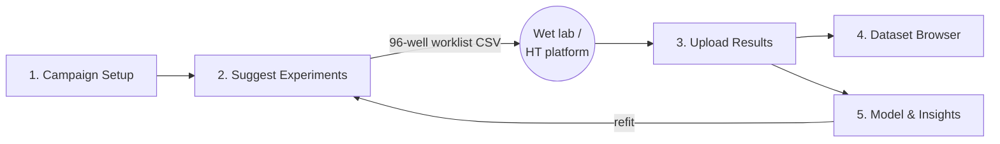
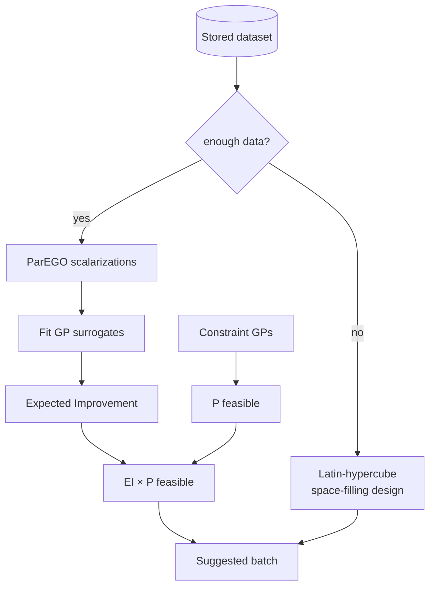

# 🧫 MPP Optimizer

**Machine-learning–driven design of muco-penetrating liposomal nanoparticles (MPPs).**

Upload your experimental data, and a multi-objective **Bayesian optimizer** proposes the next lipid
compositions to test — an active-learning loop that gets smarter every round. It is a single,
self-contained **Streamlit** web app backed by a local SQLite database, with **no external services
and no GPU/PyTorch dependency** (the Bayesian engine runs on scikit-learn Gaussian Processes).

---

## Table of contents

- [Why this exists](#why-this-exists)
- [What it does](#what-it-does)
- [Quickstart](#quickstart)
- [The workflow (the five pages)](#the-workflow-the-five-pages)
- [How the Bayesian optimization works](#how-the-bayesian-optimization-works)
- [The data model](#the-data-model)
- [The synthetic benchmark (demo without lab data)](#the-synthetic-benchmark-demo-without-lab-data)
- [Configuration](#configuration)
- [Testing](#testing)
- [Project layout](#project-layout)
- [FAQ & limitations](#faq--limitations)
- [Roadmap](#roadmap)
- [License](#license)

---

## Why this exists

Mucus is the body's first line of defence — a sticky, mesh-like gel that coats the airways, gut,
and other surfaces and traps most foreign particles. In respiratory disease the mucus is thicker
still, so getting a drug **through** it is a major bottleneck for inhaled and mucosal nanomedicines.

**Muco-penetrating particles (MPPs)** are engineered to slip through this mesh — typically by being
small, near-neutral in surface charge, and coated with PEG so mucus doesn't stick to them
("muco-inert"). A liposomal MPP is a tiny fat bubble (lipid bilayer sphere) whose behaviour is set
by its **recipe**: which lipids you use and in what proportions, plus how you manufacture it.

The catch: that recipe space is enormous. With dozens of candidate lipids, continuous mole-fraction
ratios, and process parameters, there are **millions** of possible formulations, and each wet-lab
test is slow and expensive. You cannot brute-force it.

This tool treats formulation as a **multi-objective black-box optimization** problem and uses
**Bayesian optimization (active learning)** to spend experiments wisely: fit a probabilistic model to
what you've measured so far, then propose the formulations most likely to improve the outcomes you
care about (mucus penetration, cargo retention, size, low polydispersity, near-neutral charge).

---

## What it does

- 📋 **Define a campaign** — choose the lipids in play, their mole-fraction ranges, process
  parameters, and the readouts to **optimize** (objectives) and **respect** (constraints).
- ✨ **Suggest experiments** — the optimizer proposes the next batch of compositions. Cold start
  (little/no data) → a space-filling design to seed your first 96-well plate; afterwards →
  constrained, multi-objective Bayesian suggestions. Export a **96-well worklist CSV**.
- ⬆️ **Upload results** — a guided form to enter measured readouts plus drag-and-drop **file
  attachments** (Excel, PDF, microscopy images, MSD plots, markdown/text notes).
- 🗂️ **Browse the dataset** — one standardized table linking composition → attributes → readouts;
  filter, export to CSV/Excel, and preview attachments.
- 📈 **Model & insights** — the **Pareto trade-off front**, the recommended best compositions,
  **factor sensitivity** (which lipids/params matter most), **partial-dependence** curves, and a
  leave-one-out **predicted-vs-observed** fit.
A full beginner-friendly **project guide PDF** — the science, the algorithm from first principles
(normal distribution → Gaussian Processes → Bayesian optimization), how to run the app, and how it
was built with Claude Code — can be generated with `python scripts/make_guide_pdf.py`.

---

## Preconfigured study: mucin-diffusion characterisation

The app ships with a ready-made campaign matching a specific study design — mapping liposome
formulation + physicochemical properties to particle mobility in mucin (from multiple-particle
tracking, MPT):

- **Input features (7):** `DDAB`, `DSPG`, `HSPC`, `Cholesterol`, `mPEG` molar ratios (HSPC is the
  structural/filler lipid) **plus** liposome `size_nm` and `zeta_mv` as measured input features.
- **Diffusion outputs (5):**
  - `D_mucin_um2s` — diffusion coefficient in mucin from tracks > 5 s (µm²/s)
  - `D1_brownian` — D₁ at 1 s (Brownian / linear-MSD model)
  - `Dalpha_10s` — Dα at 10 s (non-linear / anomalous-MSD model)
  - `alpha_exponent` — anomalous exponent α (≈1 free diffusion, <1 hindered/subdiffusive)
  - `net_to_path` — net-to-path (straightness) ratio (→1 directed, →0 confined)

The aim is to **characterise and distinguish particle mobility**: on **Model & Insights**, pick any
diffusion output to see which inputs drive it (ARD importances), how it responds (partial
dependence), and how well it's predicted (leave-one-out). Create it from **Campaign Setup → Quick
start → Create diffusion-study campaign**, or seed synthetic data with
`python scripts/seed_diffusion_demo.py`.

> Because size and zeta are consequences of the formulation, using them as inputs suits a
> *characterisation* model. To *design* new formulations you'd additionally predict size/zeta from
> composition — a straightforward extension.

## Quickstart

Requires **Python 3.9+**. From the project root:

```bash
# 1. create an isolated environment and install dependencies
python3 -m venv .venv
.venv/bin/python -m pip install -r requirements.txt

# 2. (optional but recommended) populate a synthetic demo campaign so everything
#    works end-to-end even before you have any real lab data
.venv/bin/python scripts/seed_demo.py

# 3. launch the app
.venv/bin/python -m streamlit run app.py
```

Then open the URL Streamlit prints (default <http://localhost:8501>). If you ran the seed script,
a fully populated demo campaign is already there — open **Model & Insights** to see the Pareto
front immediately.

> **Windows:** use `.venv\Scripts\python` instead of `.venv/bin/python`.

---

## The workflow (the five pages)

The active-learning loop, page by page:



### 1. Campaign Setup
Define the optimization problem:
- **Lipid components** — pick from the seeded library (structural PCs, cholesterol, PEG-lipids,
  cationic/anionic/ionizable lipids). Set a min/max mole fraction per lipid and mark exactly **one**
  as the *structural / filler* lipid (it absorbs the remaining fraction so every recipe sums to 1).
- **Process parameters** — e.g. total lipid concentration, aqueous:organic flow ratio.
- **Objectives** — the readouts to optimize, each `max`, `min`, or `target` (e.g. maximise mucus
  penetration, target ~100 nm size).
- **Constraints** — hard requirements the optimizer keeps feasible (e.g. `PDI ≤ 0.3`,
  `-10 ≤ zeta ≤ 10 mV`).

There's a one-click **"Create demo campaign"** button to get started instantly.

### 2. Suggest Experiments
Choose how many formulations you want; the optimizer returns a batch. A `method` tag tells you
whether they came from a **space-filling** design (cold start) or **Bayesian** optimization. Export
the batch as a **96-well worklist CSV** for your liquid-assembly platform, or save it as *planned*
experiments to fill in later.

### 3. Upload Results
Pick a planned experiment (or add a new record), enter the composition/process/readouts in a guided
form, and attach the raw files. Attachments are **stored and previewed, not parsed** — you confirm
the key numbers yourself, which keeps the dataset clean and trustworthy.

### 4. Dataset Browser
The whole campaign as one flat, standardized table (`x:` composition columns, `p:` process columns,
`y:` readout columns). Filter by status, **export CSV/Excel**, and inspect any experiment's
attachments (images render inline; PDFs show extracted text; Excel files preview as tables).

### 5. Model & Insights
Refit the model and read the results:
- **Pareto front** — the best achievable trade-offs found so far (feasible points meeting all
  constraints), plotted for any two objectives.
- **Recommended best compositions** — top formulations by weighted performance.
- **Factor sensitivity** — how strongly each lipid/parameter moves the primary objective.
- **Partial-dependence curves** — the predicted objective as each top factor varies.
- **Predicted vs observed** — leave-one-out check of how well the surrogate generalizes.

---

## How the Bayesian optimization works

The engine lives in [`mpp/optimizer.py`](mpp/optimizer.py). It is a lightweight,
dependency-robust multi-objective Bayesian optimizer built entirely on scikit-learn + SciPy.

**Problem framing.** Each formulation is a point `x` = (free lipid mole-fractions, process
parameters). Running it yields several noisy readouts. We want the formulations that best satisfy a
set of objectives while meeting constraints — i.e. constrained **multi-objective black-box
optimization** where evaluations (wet-lab runs) are the expensive resource.

**1. Encoding & the composition simplex.** Only the *free* lipids are optimization dimensions; the
structural/filler lipid is `1 − Σ(free fractions)`, which keeps every recipe on the mixture simplex
(fractions ≥ 0 and sum to 1) automatically. Dimensions are scaled to the unit cube for a
well-conditioned model.

**2. Surrogate model.** A Gaussian Process (`GaussianProcessRegressor`) with an **ARD-RBF kernel**
— a separate lengthscale per dimension. The GP gives a mean prediction **and** an uncertainty at any
untried composition; the per-dimension lengthscales double as an interpretability signal (a short
lengthscale ⇒ the objective changes fast along that factor ⇒ that factor matters).

**3. Multi-objective via ParEGO.** For each point in a requested batch we draw a random weight
vector on the simplex and collapse the objectives into a single scalar with the **augmented
Tchebycheff** scalarization. A fresh GP is fit to that scalarization and one point is selected.
Different random weights across the batch trace out different parts of the **Pareto front**, so a
batch is naturally diverse rather than all chasing the same corner. (A small distance penalty
further discourages near-duplicate picks.)

**4. Acquisition function.** Points are ranked by **Expected Improvement (EI)** — the expected
amount by which a candidate beats the best result so far, which balances exploiting good regions
against exploring uncertain ones.

**5. Constraints → constrained EI.** Each constrained readout (e.g. zeta, PDI) gets its own GP. For
a candidate we compute the **probability the constraint is satisfied** (from the GP's predictive
normal) and multiply EI by it. Suggestions are thus pulled toward the feasible region without ever
hard-excluding informative points.

**6. Cold start.** With fewer than `MIN_POINTS_FOR_MODEL` completed experiments there isn't enough
data to fit a useful GP, so suggestions come from a **Latin-hypercube space-filling design** —
perfect for seeding your first plate broadly.

**7. Statelessness = single source of truth.** The optimizer holds no state; it is **rebuilt from
the stored dataset on every call**. Your SQLite database is the only source of truth, so results are
reproducible and there's no hidden model to keep in sync.

**Interpretability outputs.** ARD lengthscales → normalized **factor importances**;
one-factor-at-a-time GP sweeps → **partial-dependence** curves; and a **leave-one-out** loop →
predicted-vs-observed, an honest check of generalization on held-out experiments.



---

## The data model

Defined in [`mpp/schema.py`](mpp/schema.py) (validated with pydantic) and persisted via SQLAlchemy
in [`mpp/db.py`](mpp/db.py). Four tables in a single SQLite file (`data/mpp.db`):

| Table         | Holds |
|---------------|-------|
| `lipids`      | The seeded lipid library (name, category, full chemical name). |
| `campaigns`   | An optimization problem: the full `CampaignConfig` JSON (components, process params, objectives, constraints). |
| `experiments` | One formulation: `composition` `{lipid → mole fraction}`, `process` `{param → value}`, `readouts` `{readout → value}`, plus status (`suggested`/`completed`) and provenance. |
| `attachments` | Uploaded files linked to an experiment (stored under `data/attachments/<experiment_id>/`). |

One `experiment` row = one row of the *standardized dataset* the whole project is built around,
linking **lipid composition → particle attributes → mucus-transport readouts**.

---

## The synthetic benchmark (demo without lab data)

Because you may not have data yet, [`mpp/benchmark.py`](mpp/benchmark.py) provides a **synthetic
ground truth** — a plausible analytic model mapping a formulation to readouts, with realistic
trade-offs baked in:

- PEG near a sweet spot **and** near-neutral zeta maximise mucus penetration (muco-inert behaviour);
- cholesterol boosts encapsulation/retention, but too much PEG hurts them (a real tension the
  optimizer must navigate);
- size is driven by lipid concentration and flow ratio.

`scripts/seed_demo.py` uses it to create a demo campaign, run a space-filling seed round **and** a
Bayesian round, and store the results — so you can watch the full loop work and demo it immediately.
Swap in real measurements and the synthetic model is never used again.

---

## Configuration

Knobs live in [`mpp/config.py`](mpp/config.py):

- `MIN_POINTS_FOR_MODEL` — completed experiments required before the GP model replaces the
  space-filling design (default `6`).
- `STANDARD_READOUTS` — the menu of readouts (name, unit, default direction) offered in the UI.
- `DATA_DIR` / `DB_PATH` / `ATTACH_DIR` — where the database and attachments live.

The lipid library is seeded from [`mpp/lipids.py`](mpp/lipids.py) — add entries there to expand it.

---

## Testing

```bash
.venv/bin/python -m pytest -q
```

Covers the DB/JSON round-trip and schema validation, the cold-start → Bayesian switch, composition
sum-to-1 on the simplex, constraint feasibility flagging, sensitivity-analysis shapes, and a
convergence test proving the optimizer finds good compositions on the synthetic benchmark.

---

## Project layout

```
app.py                  Streamlit entry / overview page
pages/                  the five workflow pages (Streamlit multipage)
  1_Campaign_Setup.py
  2_Suggest_Experiments.py
  3_Upload_Results.py
  4_Dataset_Browser.py
  5_Model_and_Insights.py
mpp/
  config.py             paths, constants, standard readouts
  schema.py             pydantic data contract (campaign + experiment)
  db.py                 SQLAlchemy models + session (SQLite)
  lipids.py             seeded lipid library
  storage.py            attachment file handling + previews
  optimizer.py          the MOBO engine (GP + ParEGO + constrained EI)
  benchmark.py          synthetic mucus-penetration ground truth
  service.py            high-level DB operations used by the UI
  ui.py                 shared Streamlit helpers
scripts/seed_demo.py    populate a synthetic demo campaign
tests/                  db round-trip + optimizer tests
data/                   SQLite db + attachments (created at runtime; git-ignored)
```

---

## FAQ & limitations

**Why scikit-learn Gaussian Processes and not Ax/BoTorch?** Modern Ax requires Python ≥3.10 and
pulls in PyTorch. To stay lightweight, fast to install, and runnable on Python 3.9 with no GPU, the
engine is built directly on scikit-learn GPs + SciPy. The behaviour — GP surrogate, multi-objective,
constraints, Pareto front, sensitivities — is equivalent for this scale of problem.

**Bayesian optimization vs. a Bayesian *network*.** This tool does Bayesian **optimization** —
finding the best composition via an active-learning loop. A Bayesian *network* (a graph of
probabilistic dependencies for mechanistic interpretation) is a complementary idea that could be
layered on the accumulated dataset later; it isn't what drives the search here.

**Scale.** Single local user, SQLite + a local attachments folder — ideal for a lab/research tool.
The leave-one-out fit refits one GP per experiment, so it's snappy up to a few hundred records. For
multi-user or cloud use, promote to a server database and a service backend.

**Attachments aren't parsed.** By design — values are entered/confirmed in the form so the dataset
stays clean. Automated extraction from PDFs/images is a possible future add-on.

---

## Roadmap

- Automated value extraction from uploaded spreadsheets/PDFs/plots (OCR + parsing).
- A Bayesian-network analysis over the dataset for mechanistic interpretation.
- Batch acquisition that fills a plate with a mix of exploit + explore points.
- Optional server backend (FastAPI + Postgres) for multi-user deployments.

---

## License

MIT — see [LICENSE](LICENSE).

> This project began as an internal prototype; the demo data is entirely synthetic. Validate any
> formulation experimentally before drawing scientific conclusions.
